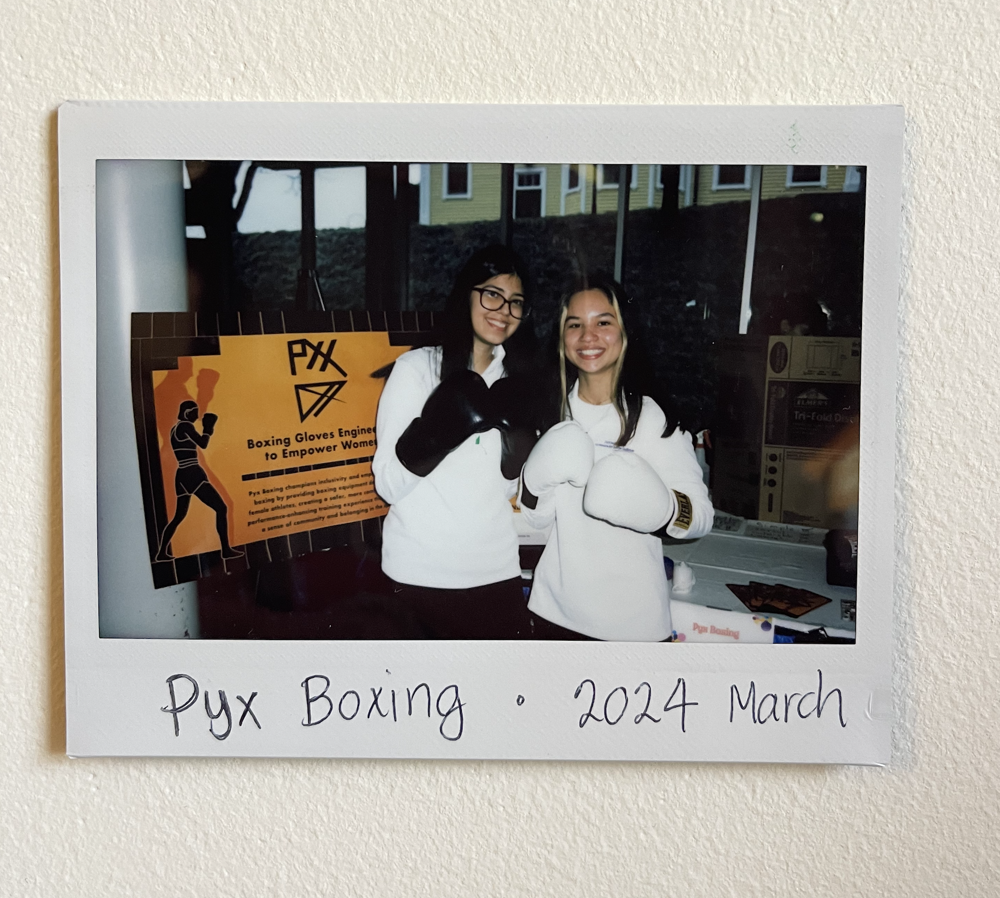
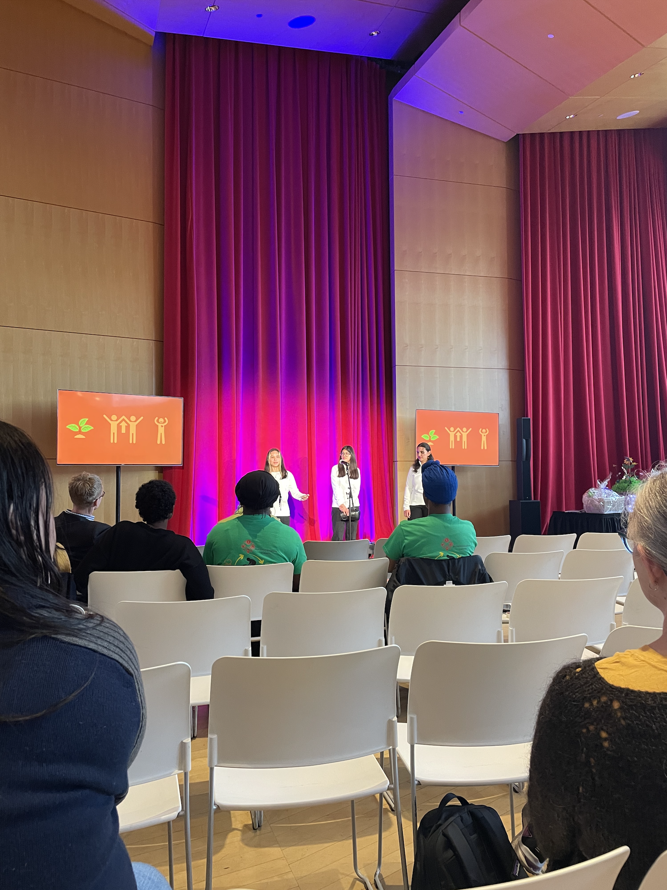
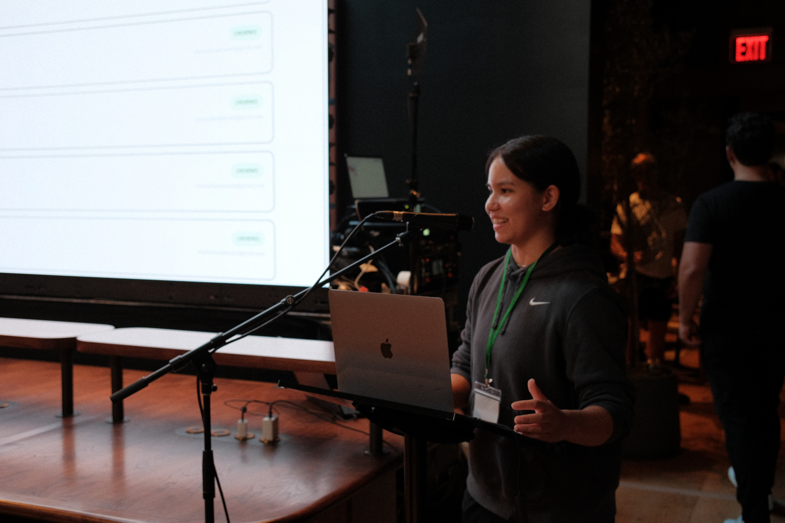

# Chaira Harder

### iOS Developer | Code Architect | Fighter | NYC && BC

<h3>Hey! Welcome and schön, dass du da bist!</h3>

---

  
  
  
  
  

---

I'm Chaira, an iOS developer from  <b>BC, Canada</b> currently living in the  <b>New York City</b> region.

I am passionate about building tech that supports health, financial empowerment, and community development.

I'm always happy to connect — feel free to <a href="https://www.chairaharder.com" target="_blank">reach out</a>!

---

<h3>Check out my stack!</h3>

<h5>iOS / Apple Dev</h5>

  
  
  
  
  

<h5>Languages: CS / Stats / Finance / Scientific</h5>

  
  
  
  
  
  
  
  

<h5>Frontend & Markup</h5>

  
  
  
  
  

<h5>Backend & Frameworks</h5>

  
  
  

<h5>DevOps & CI/CD</h5>

  
  
  
  
  

<h5>Cloud & Databases</h5>

  
  
  
  
  
  
  

<h5>Network Security & Cyber Tools</h5>

  
  

---

<h3>I'm probably at the gym but you can also find me here</h3>

  
  
  

